<div align="center">
  
  <h1>OakAttest</h1>
  <p><strong>Open-source IRAP assessment workspace for assessor firms and client organisations.</strong></p>
</div>

OakAttest is an open-source IRAP assessment workspace for ASD-registered assessor
firms and the client organisations they assess. It is designed for self-hosted
deployments and supports the assessment lifecycle from organisation setup through
scoping, evidence collection, fieldwork, findings, certification, and ongoing
compliance maintenance.

The product focuses on practical IRAP work: ISM control applicability,
assessment boundaries, evidence quality, client collaboration, residual risk,
auditability, and exportable artefacts that can support a client authorisation
decision.

## Product Screenshots

The screenshots below are generated by `npm run screenshots:readme` using a
disposable account, organisation, client, and Cloud IRAP engagement. They are
viewport captures so the README remains readable.

<details>
  <summary><strong>Signup</strong></summary>
  <br />
  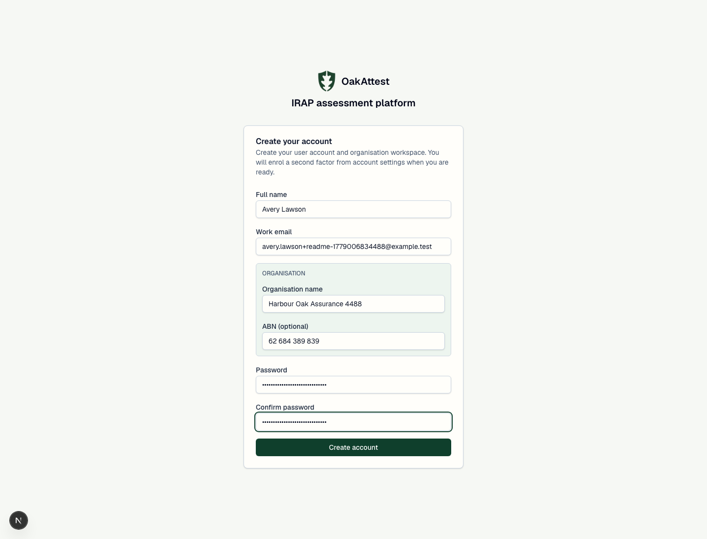
</details>

<details>
  <summary><strong>Data handling terms</strong></summary>
  <br />
  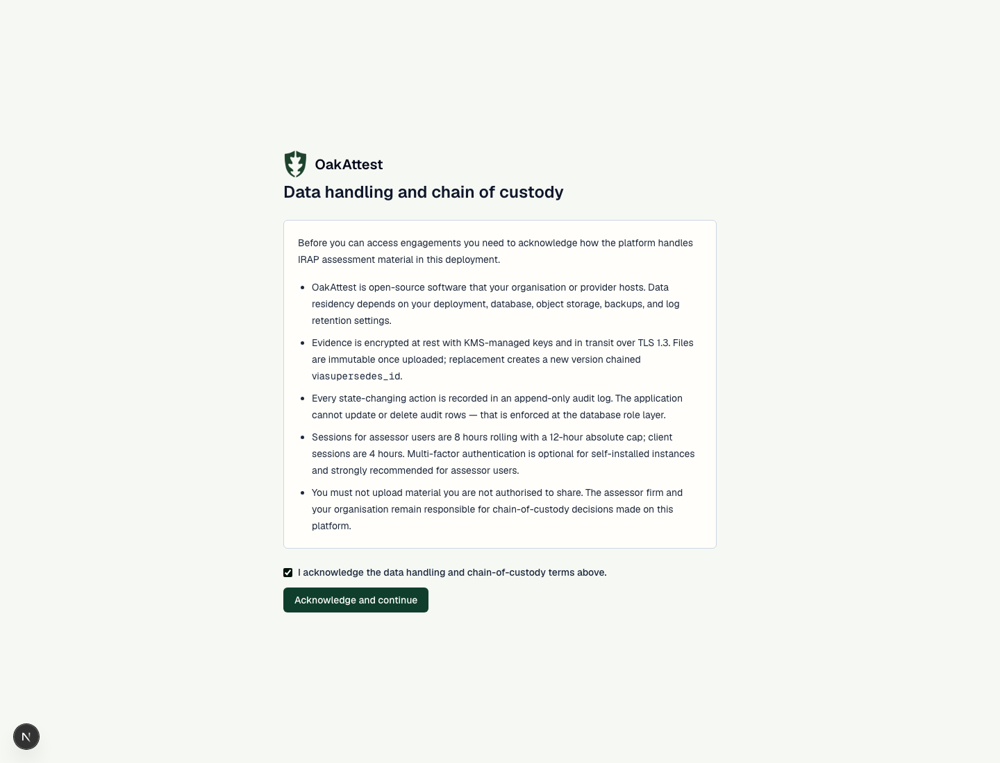
</details>

<details>
  <summary><strong>Create organisation</strong></summary>
  <br />
  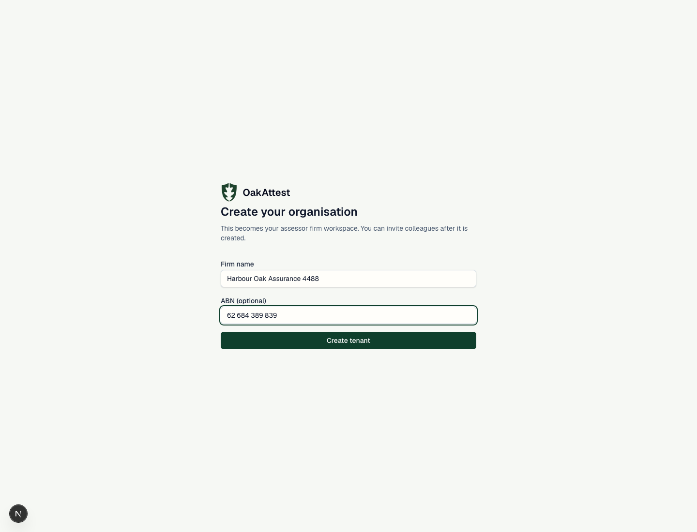
</details>

<details>
  <summary><strong>Tenant administration</strong></summary>
  <br />
  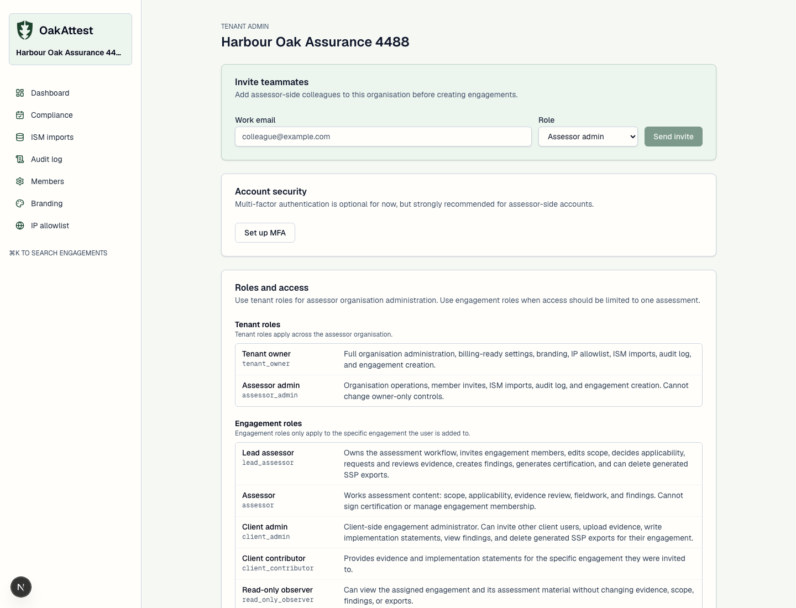
</details>

<details>
  <summary><strong>ISM imports</strong></summary>
  <br />
  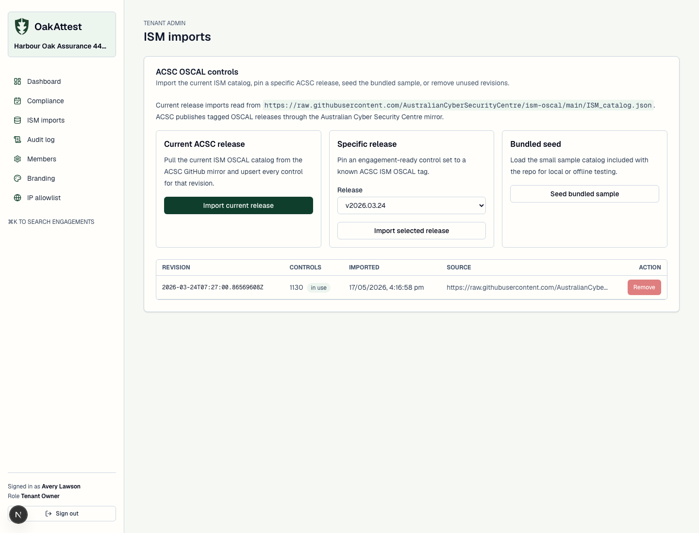
</details>

<details>
  <summary><strong>New engagement</strong></summary>
  <br />
  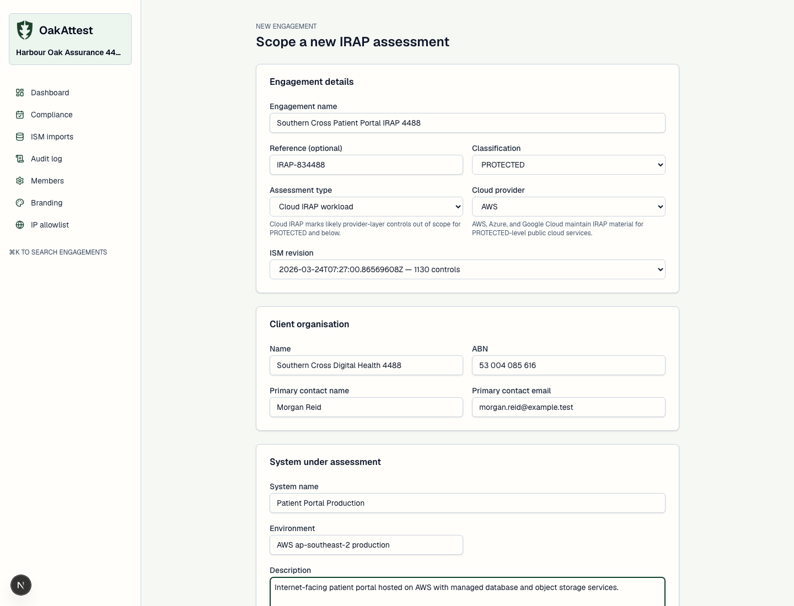
</details>

<details>
  <summary><strong>Scope, boundary, and applicability</strong></summary>
  <br />
  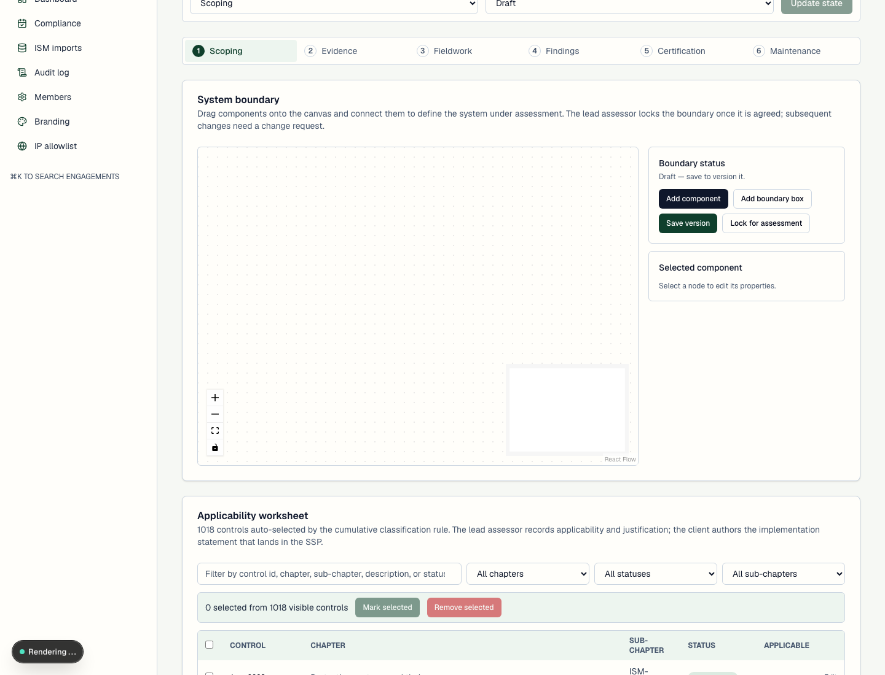
</details>

<details>
  <summary><strong>Engagement overview</strong></summary>
  <br />
  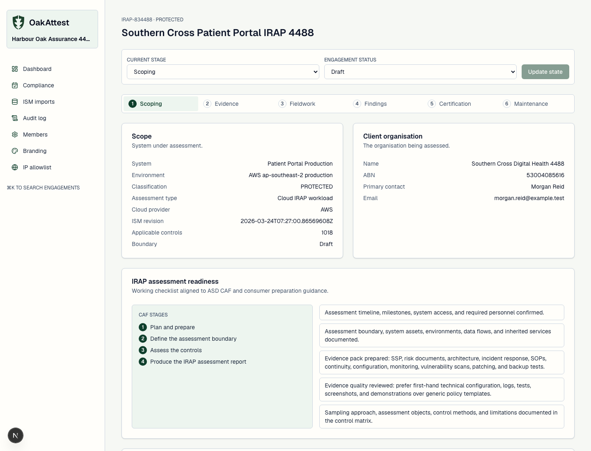
</details>

<details>
  <summary><strong>Dashboard</strong></summary>
  <br />
  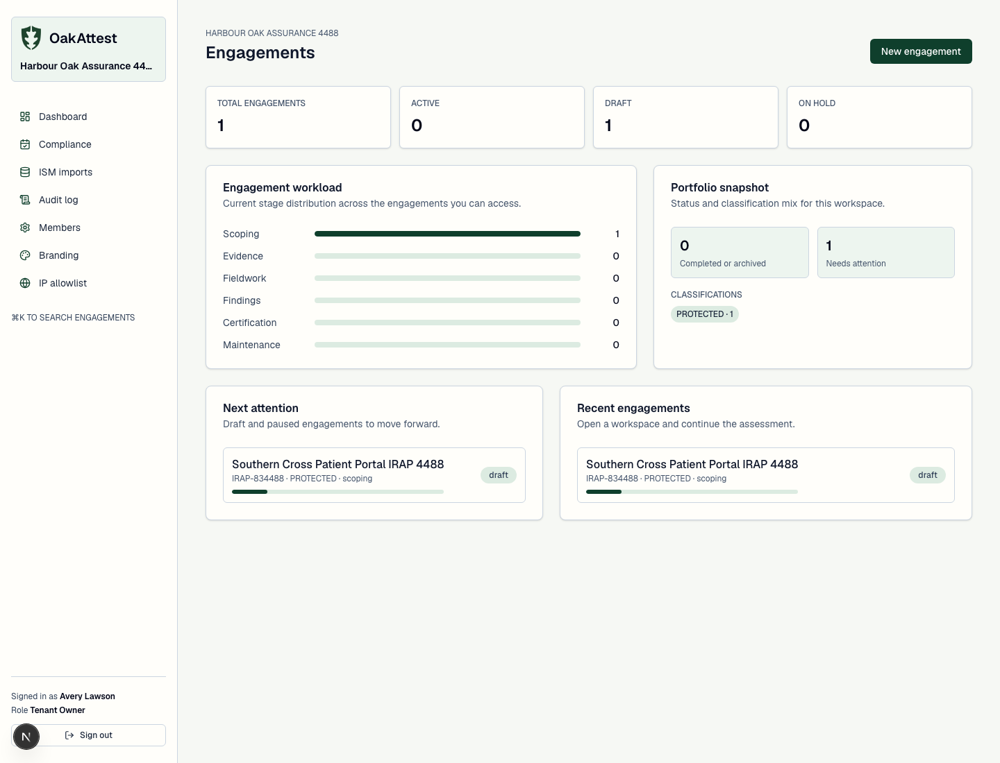
</details>

<details>
  <summary><strong>Findings</strong></summary>
  <br />
  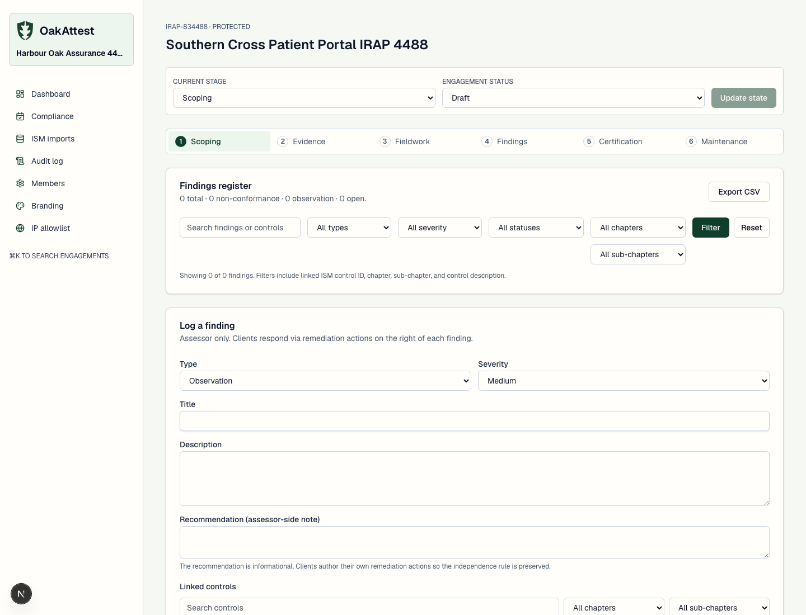
</details>

<details>
  <summary><strong>Certification</strong></summary>
  <br />
  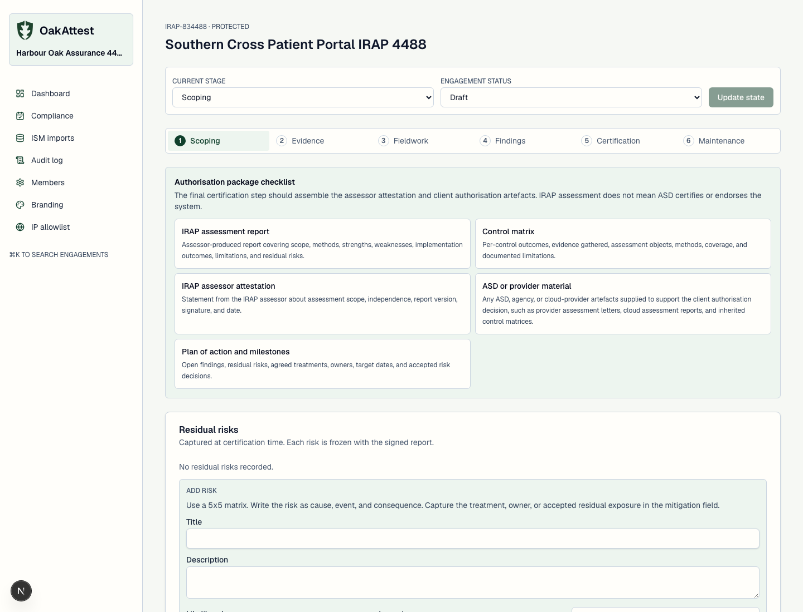
</details>

## Core Capabilities

- Organisation-first onboarding for assessor firms, with tenant roles and
  engagement-scoped client access.
- IRAP engagement workflow covering scoping, evidence, fieldwork, findings,
  certification, and maintenance.
- ACSC ISM OSCAL import panel for current releases, selected releases, bundled
  local seed data, and unused revision removal.
- Applicability worksheet with ISM chapter, sub-chapter, status, and search
  filters, plus bulk applicability decisions and bulk removal.
- Per-control CAF assessment record fields for assessment methods, assessment
  objects, evidence quality, and evidence limitations.
- React Flow system boundary drawer with typed components, boundary boxes,
  edge persistence, and exported boundary PNGs with service icons.
- Cloud IRAP engagement mode for AWS, Azure, and Google Cloud workloads up to
  PROTECTED, with conservative inherited-provider controls marked not applicable
  and justified for assessor review.
- Evidence request, upload, review, and CVE/SBOM import workflows.
- Vulnerability scan import for Nessus, Rapid7, Qualys, and generic CSV.
- Findings register linked to ISM controls, with chapter/sub-chapter filters,
  status filters, severity, and remediation actions.
- Residual risk capture using a 5x5 likelihood and impact matrix.
- SSP bundle export as a zip containing PDF, Excel workbook, and the boundary
  diagram image.
- Versioned generated files with R2/S3 storage support and admin delete flow.
- Append-only audit log with search, filters, sorting, and pagination.

## IRAP Workflow Coverage

OakAttest follows the major IRAP assessment stages:

1. Plan and prepare: organisation setup, engagement details, classification,
   client contacts, team roles, timelines, and readiness checklist.
2. Define the assessment boundary: system metadata, boundary diagram, service
   environments, data-centre or environment boxes, and Cloud IRAP provider
   context.
3. Assess controls: ISM applicability, client implementation statements,
   assessor decisions, assessment methods, assessment objects, evidence quality,
   and limitations.
4. Produce assessment artefacts: findings, residual risks, SSP bundle, control
   matrix material, assessor attestation prompts, and authorisation package
   guidance.

The app does not claim that ASD certifies, endorses, or approves a system. It
helps assessor firms and clients collect and structure the artefacts that inform
the relevant authorisation decision.

## Roles

OakAttest separates assessor organisation access from engagement access.

- `tenant_owner`: manages the assessor organisation, members, ISM imports,
  branding, IP allowlist, audit logs, and engagement creation.
- `assessor_admin`: helps administer the assessor organisation and create
  engagements.
- `lead_assessor`: leads an engagement, updates state, locks boundaries,
  creates findings, signs off findings, generates certification artefacts, and
  invites engagement members.
- `assessor`: performs assessment work, applicability decisions, evidence
  review, fieldwork, and findings work.
- `client_admin`: manages client-side participation for a specific engagement.
- `client_contributor`: uploads evidence and writes implementation statements.
- `read_only_observer`: can view permitted engagement material without editing.

## Local Development

Prerequisites:

- Node.js 22 or newer
- Docker
- npm

Start a local environment:

```bash
cp .env.example .env
npm install
docker compose up -d postgres
npm run db:migrate
npm run db:seed
npm run dev
```

The local database runs on `localhost:5432` with database `oakattest`, user
`postgres`, and password `postgres`. The application and Drizzle read
`DATABASE_URL` from `.env`.

Open the app at `http://localhost:3000`. If that port is already in use, Next.js
will print the alternate port.

## Configuration

Important environment variables:

- `DATABASE_URL`: PostgreSQL connection string.
- `BETTER_AUTH_URL`: server-side Better Auth base URL.
- `NEXT_PUBLIC_BETTER_AUTH_URL`: browser-visible Better Auth base URL.
- `BETTER_AUTH_SECRET`: local or production auth secret.
- `EMAIL_FROM`: sender for invite and magic-link emails.
- `RESEND_API_KEY`: optional, otherwise emails are logged in development.
- `R2_ACCESS_KEY_ID`, `R2_SECRET_ACCESS_KEY`, `R2_BUCKET`, `R2_ENDPOINT`,
  `R2_REGION`: Cloudflare R2 object storage.
- `S3_*`: optional AWS S3-compatible fallback settings.

See [.env.example](.env.example) for the complete local template.

## Screenshots and Playwright

Install the Playwright browser once:

```bash
npx playwright install chromium
```

Generate README screenshots:

```bash
docker compose up -d postgres
npm run db:migrate
npm run dev
npm run screenshots:readme
```

By default the screenshot script uses `http://localhost:3000`. Override it when
Next.js starts on another port:

```bash
OAKATTEST_BASE_URL=http://localhost:3001 npm run screenshots:readme
```

The script writes PNGs to `docs/screenshots/` and creates:

- a disposable assessor user
- a tenant organisation
- seeded ISM controls when required
- a fake client organisation
- a Cloud IRAP engagement
- screenshots of signup, terms, onboarding, tenant admin, ISM import, new
  engagement, scope/applicability, overview, dashboard, findings, and
  certification

## Project Layout

```text
app/          Next.js routes, server actions, auth, app, and admin surfaces
components/   Feature components and shared UI primitives
db/           Drizzle schema, migrations, and seed data
docs/         Architecture notes, infrastructure notes, screenshots
emails/       React Email templates
lib/          Auth, RBAC, audit, ISM import, boundary rendering, PDF/XLSX, storage
public/       Logo, favicon, templates, static assets
scripts/      Operational scripts, ISM import, README screenshot automation
```

## Useful Commands

```bash
npm run dev              # Start the Next.js dev server
npm run build            # Build the app
npm run lint             # Run ESLint
npm run typecheck        # Run TypeScript without emitting
npm test                 # Run Vitest
npm run db:migrate       # Apply Drizzle migrations
npm run db:seed          # Seed local test data
npm run ism:import       # Import ISM controls from configured source
npm run screenshots:readme
```

## Security and Deployment Notes

- OakAttest is self-hosted. Residency, backup, logging, and object-storage
  claims depend on the deployment environment you operate.
- MFA is optional by default for local/self-installed use, but strongly
  encouraged for assessor-side accounts.
- Evidence and exported files are intended for S3-compatible object storage,
  including Cloudflare R2.
- Audit logs are append-only at the application layer and are presented with
  actor email addresses rather than opaque user IDs.
- Do not upload assessment material you are not authorised to store in the
  deployment.

## Licence

OakAttest is licensed under the GNU Affero General Public License v3.0 or later.
See [LICENSE](LICENSE).
