<div align="center">
  
  <h1>OakAttest</h1>
  <p><strong>Open-source IRAP assessment workspace for assessor firms and client organisations.</strong></p>
</div>

OakAttest is an open-source IRAP assessment workspace for ASD-registered assessor
firms and the client organisations they assess. It is designed for self-hosted
deployments and supports the assessment lifecycle from organisation setup through
scoping, evidence collection, fieldwork, findings, certification, and ongoing
compliance maintenance.

The product focuses on practical IRAP work: ISM control applicability,
assessment boundaries, evidence quality, client collaboration, residual risk,
auditability, and exportable artefacts that can support a client authorisation
decision.

## Burl AI Helper


Burl is OakAttest's oak-based AI helper for evidence and ISM questions. It is
available as a bottom-right assistant popup throughout the authenticated product
and as a dedicated `/burl` workspace.

Burl can:

- Answer ISM questions in the context of the selected engagement revision.
- Suggest likely ISM control mappings for attached PDF evidence.
- Draft client evidence requests and assessor notes for human review.
- Highlight weak evidence, missing scope details, and evidence limitations.

Burl does not approve evidence, mark controls as satisfied, or change assessment
records automatically. Outputs are suggestions for an assessor or authorised
user to review before they are copied into the assessment record.

The first provider implementation uses Amazon Bedrock. Local development can
use the AU Bedrock inference profile:

```env
OAK_AI_PROVIDER=bedrock
OAK_AI_BEDROCK_MODEL_ID=au.anthropic.claude-haiku-4-5-20251001-v1:0
AWS_REGION=ap-southeast-2
AWS_ACCESS_KEY_ID=...
AWS_SECRET_ACCESS_KEY=...
```

When a user attaches a PDF, OakAttest extracts text server-side and sends that
text with the current Burl request. The request is audited with the provider,
model ID, selected engagement, message count, and attachment summary.

## Certification Signing

Certification bundles are signed by default with a deployment-managed signing
secret (`CERTIFICATION_SIGNING_SECRET`, falling back to `BETTER_AUTH_SECRET`).
Tenant owners can optionally register an AWS KMS asymmetric RSA key in **Tenant
admin → Certification signing** for stronger key isolation. When a tenant KMS
key exists, OakAttest stores the KMS ARN, public key, and fingerprint, then
signs bundle hashes with RSA-PSS SHA-256.

## Product Screenshots

The screenshots below are generated by `npm run screenshots:readme` using a
disposable account, organisation, client, and Cloud IRAP engagement. They are
viewport captures so the README remains readable.

<details>
  <summary><strong>Signup</strong></summary>
  <br />
  
</details>

<details>
  <summary><strong>Data handling terms</strong></summary>
  <br />
  
</details>

<details>
  <summary><strong>Create organisation</strong></summary>
  <br />
  
</details>

<details>
  <summary><strong>Tenant administration</strong></summary>
  <br />
  
</details>

<details>
  <summary><strong>ISM imports</strong></summary>
  <br />
  
</details>

<details>
  <summary><strong>New engagement</strong></summary>
  <br />
  
</details>

<details>
  <summary><strong>Scope, boundary, and applicability</strong></summary>
  <br />
  
</details>

<details>
  <summary><strong>Task board</strong></summary>
  <br />
  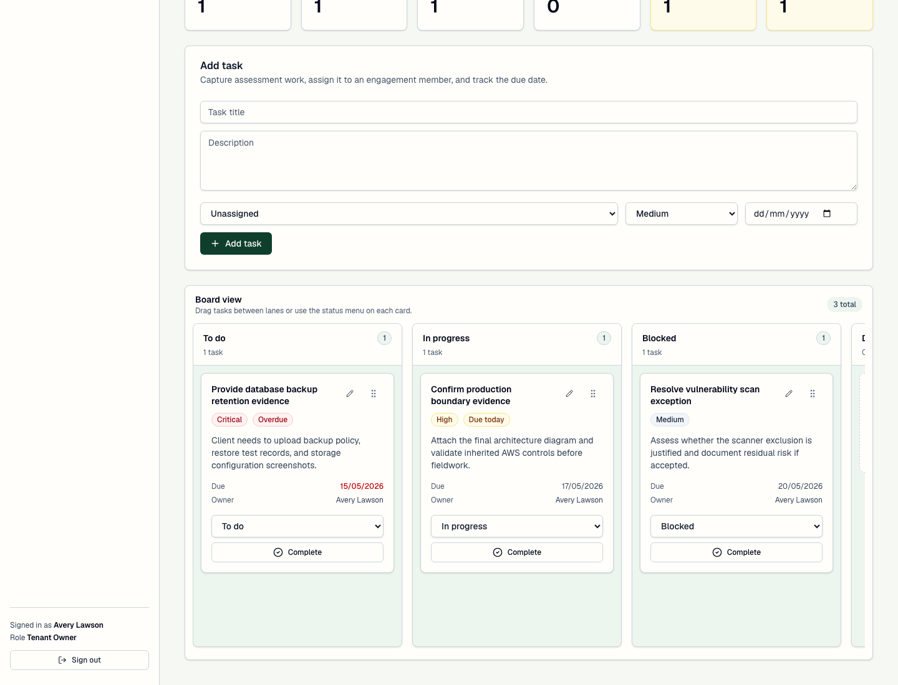
</details>

<details>
  <summary><strong>Engagement overview</strong></summary>
  <br />
  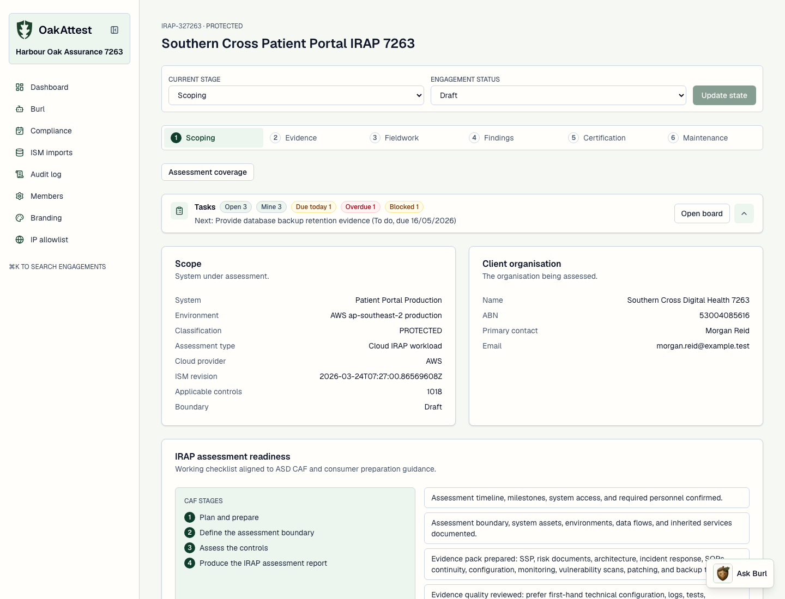
</details>

<details>
  <summary><strong>Dashboard</strong></summary>
  <br />
  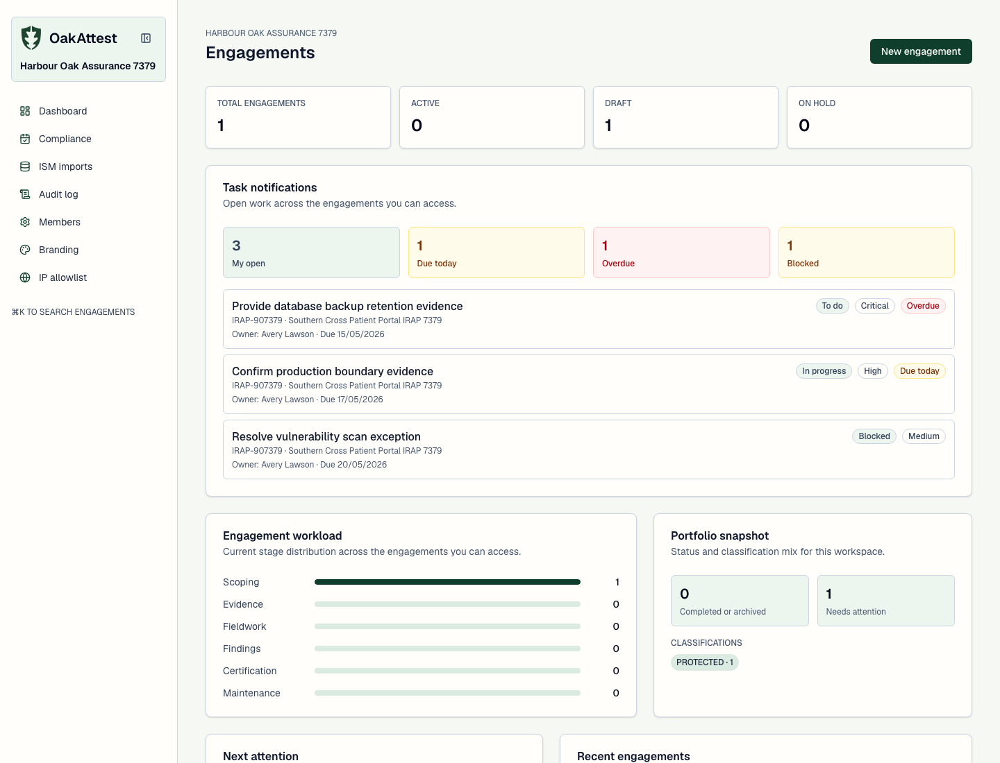
</details>

<details>
  <summary><strong>Findings</strong></summary>
  <br />
  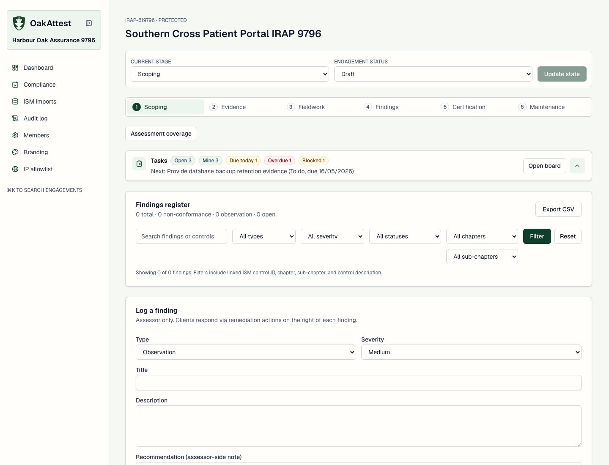
</details>

<details>
  <summary><strong>Certification</strong></summary>
  <br />
  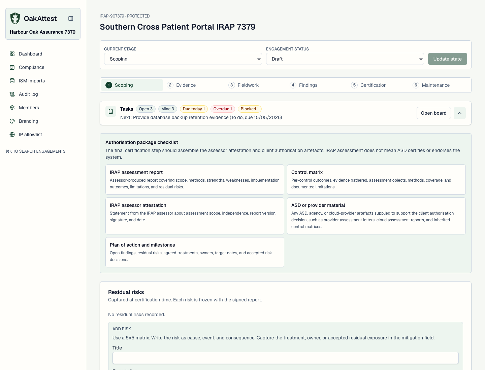
</details>

<details>
  <summary><strong>Essential Eight</strong></summary>
  <br />
  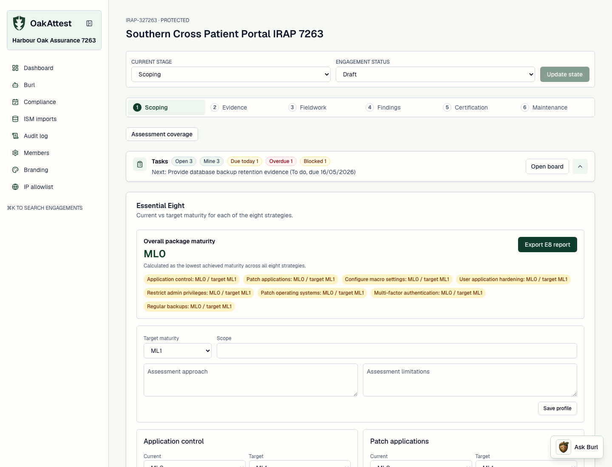
</details>

<details>
  <summary><strong>Enterprise evidence guidance</strong></summary>
  <br />
  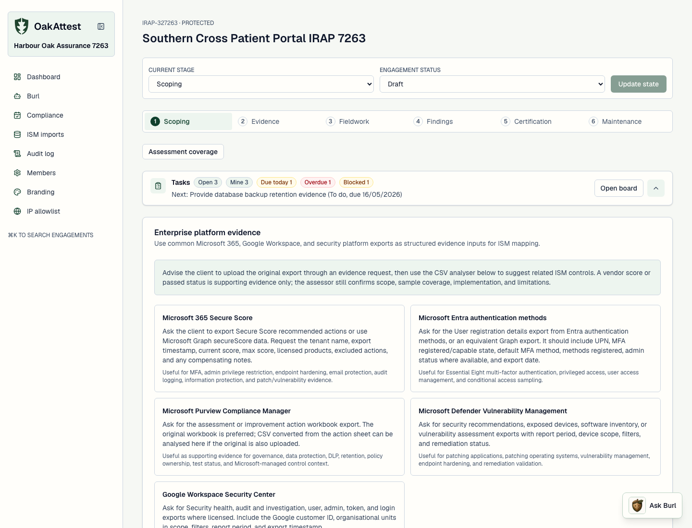
</details>

<details>
  <summary><strong>Assessment coverage</strong></summary>
  <br />
  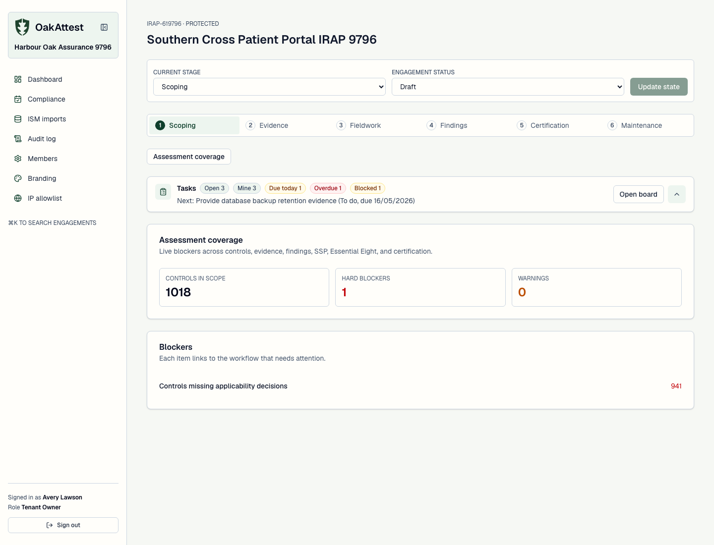
</details>

<details>
  <summary><strong>Ongoing compliance</strong></summary>
  <br />
  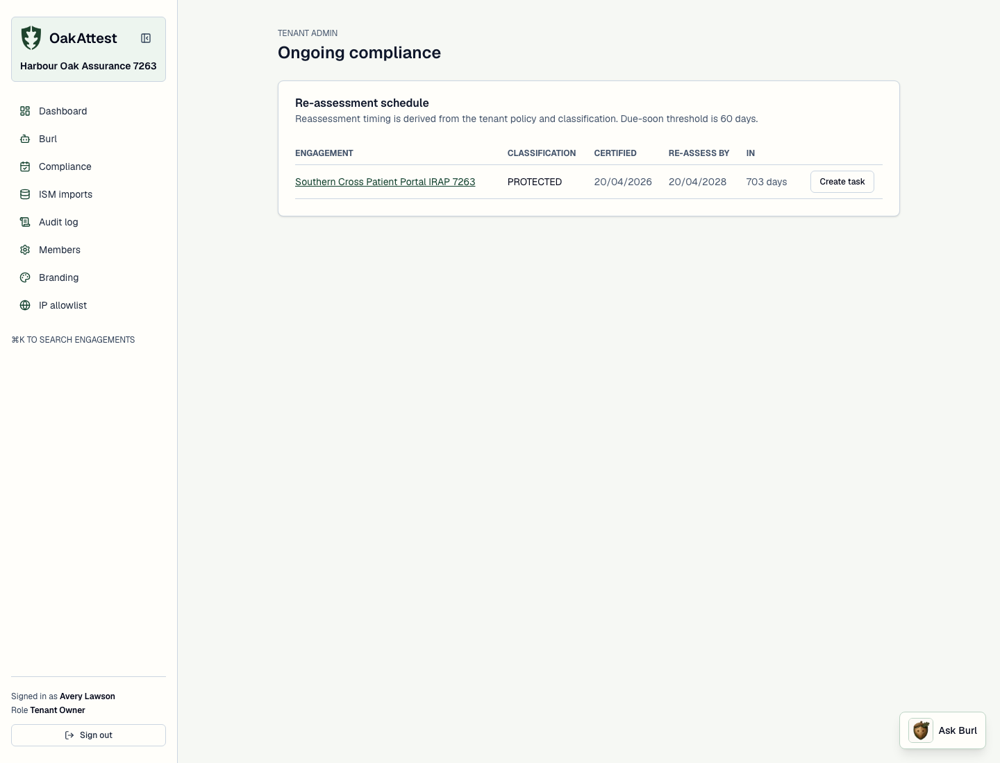
</details>

<details>
  <summary><strong>Burl engagement questions</strong></summary>
  <br />
  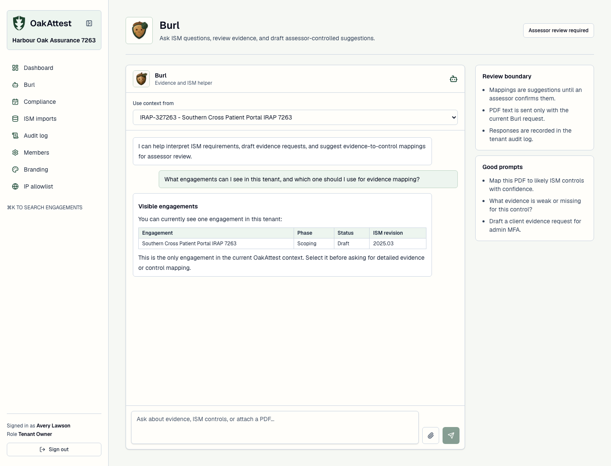
</details>

<details>
  <summary><strong>Burl PDF evidence mapping</strong></summary>
  <br />
  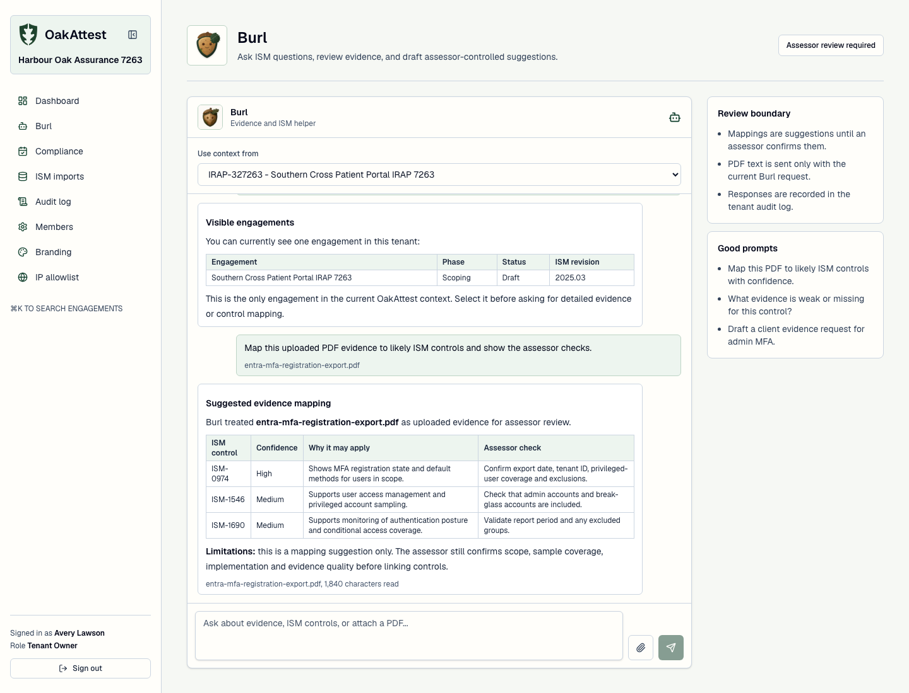
</details>

## Core Capabilities

- Organisation-first onboarding for assessor firms, with tenant roles and
  engagement-scoped client access.
- IRAP engagement workflow covering scoping, evidence, fieldwork, findings,
  certification, and maintenance.
- Essential Eight profile, maturity assessment, history, evidence fields, and
  versioned PDF assessment reports within each engagement.
- Assessment coverage dashboard that highlights blockers across controls,
  evidence, findings, SSP material, Essential Eight, and certification.
- Burl AI helper popup and dedicated workspace for ISM questions, PDF evidence
  review, draft evidence requests, and assessor-controlled mapping suggestions.
- Engagement task board with owners, due dates, overdue/due-today signals,
  dashboard notifications, and collapsible engagement task summaries.
- ACSC ISM OSCAL import panel for current releases, selected releases, bundled
  local seed data, unused revision removal, and revision compare/migration
  prompts for pinned engagements.
- Applicability worksheet with ISM chapter, sub-chapter, status, and search
  filters, plus bulk applicability decisions and bulk removal.
- Per-control CAF assessment record fields for assessment methods, assessment
  objects, evidence quality, and evidence limitations.
- Versioned SSP section editing with assessor comments and implementation
  statement history.
- React Flow system boundary drawer with typed components, boundary boxes,
  edge persistence, and exported boundary PNGs with service icons.
- Cloud IRAP engagement mode for AWS, Azure, and Google Cloud workloads up to
  PROTECTED, with conservative inherited-provider controls marked not applicable
  and justified for assessor review.
- Evidence request, upload, review, and CVE/SBOM import workflows.
- Enterprise platform evidence guidance and CSV analysis for Microsoft 365
  Secure Score, Entra authentication methods, Purview Compliance Manager,
  Defender Vulnerability Management, Google Workspace security exports, and
  Google audit exports, with suggested ISM and Essential Eight mappings.
- Vulnerability scan import for Nessus, Rapid7, Qualys, and generic CSV.
- Findings register linked to ISM controls, with chapter/sub-chapter filters,
  status filters, severity, remediation actions, risk acceptance, and retest
  records.
- Residual risk capture using a 5x5 likelihood and impact matrix.
- Certification readiness checks before signing, including unresolved blockers
  and residual-risk prompts.
- SSP bundle export as a zip containing PDF, Excel workbook, and the boundary
  diagram image.
- Versioned generated files with R2/S3 storage support and admin delete flow.
- Tenant security policy settings for MFA enforcement, evidence retention, and
  reassessment cadence by classification.
- Append-only audit log with search, filters, sorting, and pagination.

## IRAP Workflow Coverage

OakAttest follows the major IRAP assessment stages:

1. Plan and prepare: organisation setup, engagement details, classification,
   client contacts, team roles, timelines, and readiness checklist.
2. Define the assessment boundary: system metadata, boundary diagram, service
   environments, data-centre or environment boxes, and Cloud IRAP provider
   context.
3. Assess controls: ISM applicability, client implementation statements,
   assessor decisions, assessment methods, assessment objects, evidence quality,
   and limitations.
4. Produce assessment artefacts: findings, residual risks, SSP bundle, control
   matrix material, assessor attestation prompts, and authorisation package
   guidance.

The app does not claim that ASD certifies, endorses, or approves a system. It
helps assessor firms and clients collect and structure the artefacts that inform
the relevant authorisation decision.

## Roles

OakAttest separates assessor organisation access from engagement access.

- `tenant_owner`: manages the assessor organisation, members, ISM imports,
  branding, IP allowlist, audit logs, and engagement creation.
- `assessor_admin`: helps administer the assessor organisation and create
  engagements.
- `lead_assessor`: leads an engagement, updates state, locks boundaries,
  creates findings, signs off findings, generates certification artefacts, and
  invites engagement members.
- `assessor`: performs assessment work, applicability decisions, evidence
  review, fieldwork, and findings work.
- `client_admin`: manages client-side participation for a specific engagement.
- `client_contributor`: uploads evidence and writes implementation statements.
- `read_only_observer`: can view permitted engagement material without editing.

## Local Development

Prerequisites:

- Node.js 22 or newer
- Docker
- npm

Start a local environment:

```bash
cp .env.example .env
npm install
docker compose up -d postgres
npm run db:migrate
npm run db:seed
npm run dev
```

The local database runs on `localhost:5432` with database `oakattest`, user
`postgres`, and password `postgres`. The application and Drizzle read
`DATABASE_URL` from `.env`.

Open the app at `http://localhost:3000`. If that port is already in use, Next.js
will print the alternate port.

## Configuration

Important environment variables:

- `DATABASE_URL`: PostgreSQL connection string.
- `BETTER_AUTH_URL`: server-side Better Auth base URL.
- `NEXT_PUBLIC_BETTER_AUTH_URL`: browser-visible Better Auth base URL.
- `BETTER_AUTH_SECRET`: local or production auth secret.
- `EMAIL_FROM`: sender for invite and magic-link emails.
- `RESEND_API_KEY`: optional, otherwise emails are logged in development.
- `CRON_SECRET`: shared secret for externally-triggered scheduled sync routes.
- `CRON_TIMEZONE`: timezone for in-process scheduled jobs. Defaults to `Australia/Sydney`.
- `ISM_RELEASE_SYNC_CRON`: daily ISM release sync schedule. Defaults to `0 3 * * *`.
- `OAK_AI_PROVIDER`: optional AI provider selector. Currently `bedrock`.
- `OAK_AI_BEDROCK_MODEL_ID`: Bedrock model or inference profile ID for Burl.
- `AWS_REGION`, `AWS_ACCESS_KEY_ID`, `AWS_SECRET_ACCESS_KEY`,
  `AWS_SESSION_TOKEN`: AWS credentials used by Bedrock and optional AWS KMS
  signing.
- `CERTIFICATION_SIGNING_SECRET`: optional deployment-managed certification
  signing secret. Falls back to `BETTER_AUTH_SECRET` when unset.
- `R2_ACCESS_KEY_ID`, `R2_SECRET_ACCESS_KEY`, `R2_BUCKET`, `R2_ENDPOINT`,
  `R2_REGION`: Cloudflare R2 object storage.
- `S3_*`: optional AWS S3-compatible fallback settings.

See [.env.example](.env.example) for the complete local template.

## Screenshots and Playwright

Install the Playwright browser once:

```bash
npx playwright install chromium
```

Generate README screenshots:

```bash
docker compose up -d postgres
npm run db:migrate
npm run dev
npm run screenshots:readme
```

By default the screenshot script uses `http://localhost:3000`. Override it when
Next.js starts on another port:

```bash
OAKATTEST_BASE_URL=http://localhost:3001 npm run screenshots:readme
```

The script writes PNGs to `docs/screenshots/` and creates:

- a disposable assessor user
- a tenant organisation
- seeded ISM controls when required
- a fake client organisation
- a Cloud IRAP engagement
- screenshots of signup, terms, onboarding, tenant admin, ISM import, new
  engagement, scope/applicability, task board, overview, dashboard, findings,
  certification, Essential Eight, enterprise evidence guidance, coverage, and
  ongoing compliance
- mocked Burl screenshots showing engagement questions and PDF evidence mapping
  to ISM controls

## Project Layout

```text
app/          Next.js routes, server actions, auth, app, and admin surfaces
components/   Feature components and shared UI primitives
db/           Drizzle schema, migrations, and seed data
docs/         Architecture notes, infrastructure notes, screenshots
emails/       React Email templates
lib/          Auth, RBAC, audit, ISM import, boundary rendering, PDF/XLSX, storage
public/       Logo, favicon, templates, static assets
scripts/      Operational scripts, ISM import, README screenshot automation
```

## Useful Commands

```bash
npm run dev              # Start the Next.js dev server
npm run build            # Build the app
npm run lint             # Run ESLint
npm run typecheck        # Run TypeScript without emitting
npm test                 # Run Vitest
npm run db:migrate       # Apply Drizzle migrations
npm run db:seed          # Seed local development data
npm run ism:import       # Import ISM controls from configured source
npm run screenshots:readme
```

## Security and Deployment Notes

- OakAttest is self-hosted. Residency, backup, logging, and object-storage
  claims depend on the deployment environment you operate.
- MFA is optional by default for local/self-installed use, but strongly
  encouraged for assessor-side accounts.
- Evidence and exported files are intended for S3-compatible object storage,
  including Cloudflare R2.
- Audit logs are append-only at the application layer and are presented with
  actor email addresses rather than opaque user IDs.
- Do not upload assessment material you are not authorised to store in the
  deployment.

## Licence

OakAttest is licensed under the GNU Affero General Public License v3.0 or later.
See [LICENSE](LICENSE).
